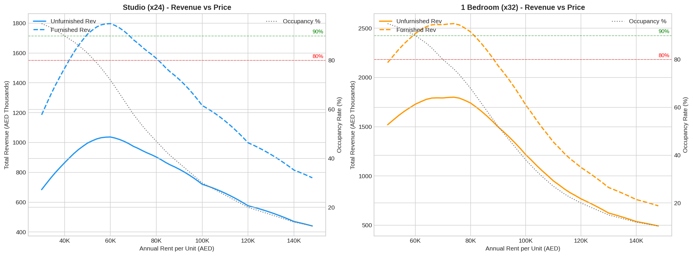
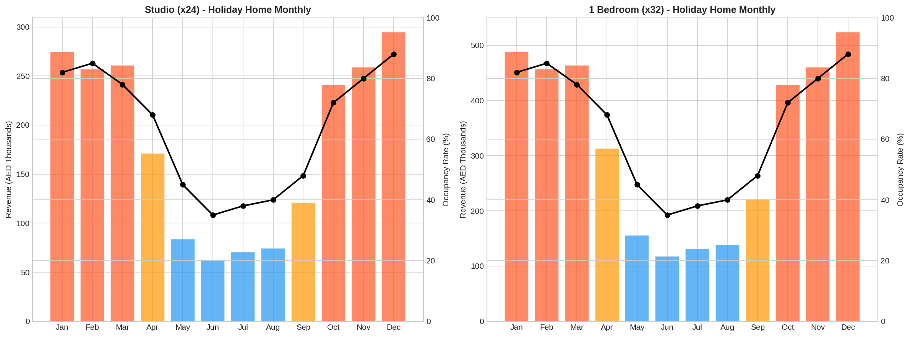
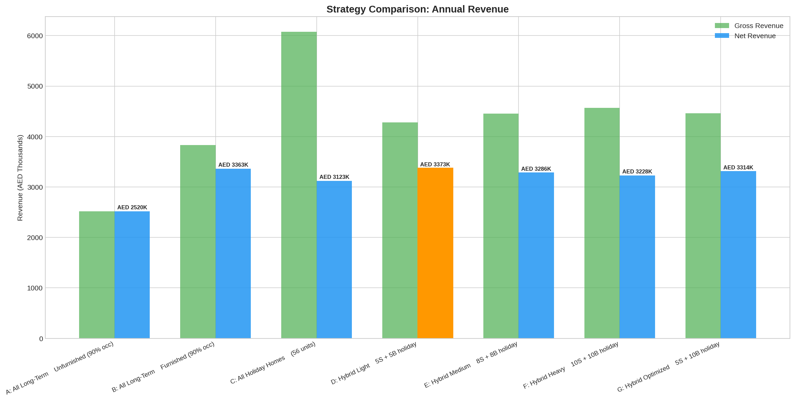
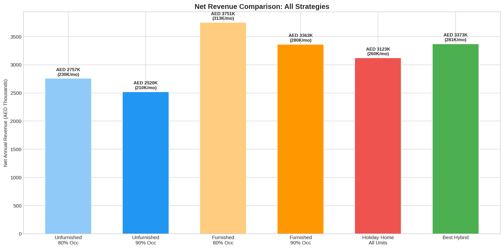
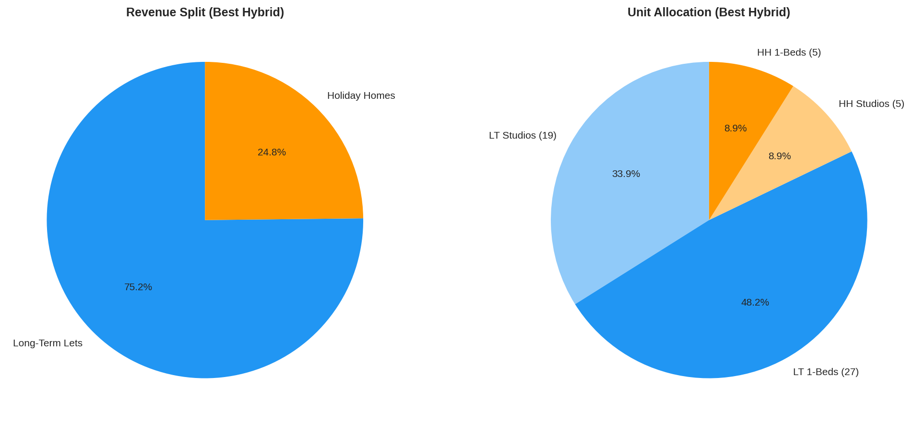

# Al Satwa Building Projections Report

**Date:** March 12, 2026
**Building:** 24 Studios + 32 One-Bedrooms = 56 Units Total
**Location:** Al Satwa, Dubai

---

## 1. Expected Rent Per Unit (Market Rate)

### At 100% Occupancy (theoretical maximum)

| | Per Unit/Year | Per Unit/Month | All Units/Year |
|--|--|--|--|
| **Studio Unfurnished** | AED 68,319 | AED 5,693 | AED 1,639,656 |
| **Studio Furnished** | AED 118,375 | AED 9,865 | AED 2,841,000 |
| **1-Bed Unfurnished** | AED 76,132 | AED 6,344 | AED 2,436,224 |
| **1-Bed Furnished** | AED 107,724 | AED 8,977 | AED 3,447,168 |
| **Building Total (Unfurn)** | | | **AED 4,075,880** |
| **Building Total (Furn)** | | | **AED 6,288,168** |

### Furnished Premium
- Studios: **+73.3%** premium when furnished
- 1-Bedrooms: **+41.5%** premium when furnished

---

## 2. Optimal Pricing for 80% and 90% Occupancy

### Target: 80% Occupancy

| Unit Type | Optimal Rent/Year | Monthly | Occupied Units | Gross Revenue/Year |
|--|--|--|--|--|
| Studio (Unfurnished) | AED 53,000 | AED 4,417 | 19 of 24 | AED 1,007,000 |
| Studio (Furnished) | AED 91,849 | AED 7,654 | 19 of 24 | AED 1,745,131 |
| 1-Bed (Unfurnished) | AED 70,000 | AED 5,833 | 25 of 32 | AED 1,750,000 |
| 1-Bed (Furnished) | AED 99,050 | AED 8,254 | 25 of 32 | AED 2,476,250 |

### Target: 90% Occupancy

| Unit Type | Optimal Rent/Year | Monthly | Occupied Units | Gross Revenue/Year |
|--|--|--|--|--|
| Studio (Unfurnished) | AED 40,000 | AED 3,333 | 21 of 24 | AED 840,000 |
| Studio (Furnished) | AED 69,320 | AED 5,777 | 21 of 24 | AED 1,455,720 |
| 1-Bed (Unfurnished) | AED 60,000 | AED 5,000 | 28 of 32 | AED 1,680,000 |
| 1-Bed (Furnished) | AED 84,900 | AED 7,075 | 28 of 32 | AED 2,377,200 |

**Key insight:** To guarantee 90% occupancy, you must price ~25% below market average. For 80%, price ~10-15% below.

---

## 3. Revenue Maximization Sweet Spots

The optimal price maximizes **total revenue** (price x occupied units), not just occupancy or rent.

| Unit Type | Optimal Price | Occupancy | Total Revenue/Year |
|--|--|--|--|
| Studio (Unfurnished) | **AED 60,000/yr** | 72% | AED 1,036,800 |
| Studio (Furnished) | **AED 100,000/yr** | 75% | AED 1,794,142 |
| 1-Bed (Unfurnished) | **AED 75,000/yr** | 75% | AED 1,800,000 |
| 1-Bed (Furnished) | **AED 105,000/yr** | 76% | AED 2,546,714 |

---

## 4. Furnished vs Unfurnished Comparison

### Furnishing Investment
| Item | Cost |
|--|--|
| Studio furnishing (x24) | AED 600,000 |
| 1-Bed furnishing (x32) | AED 1,280,000 |
| **Total investment** | **AED 1,880,000** |
| Annual amortization (4yr cycle) | AED 470,000/yr |

### At 80% Occupancy

| Metric | Unfurnished | Furnished | Difference |
|--|--|--|--|
| Studio Rent/yr | AED 53,000 | AED 91,849 | +AED 38,849 |
| 1-Bed Rent/yr | AED 70,000 | AED 99,050 | +AED 29,050 |
| Gross Revenue/yr | AED 2,757,000 | AED 4,221,381 | +AED 1,464,381 |
| Furniture Cost/yr | AED 0 | AED 470,000 | |
| **Net Revenue/yr** | **AED 2,757,000** | **AED 3,751,381** | **+AED 994,381** |
| **Net Revenue/mo** | **AED 229,750** | **AED 312,615** | **+AED 82,865** |
| ROI on furniture | | **77.9% Year 1** | |

### At 90% Occupancy

| Metric | Unfurnished | Furnished | Difference |
|--|--|--|--|
| Studio Rent/yr | AED 40,000 | AED 69,320 | +AED 29,320 |
| 1-Bed Rent/yr | AED 60,000 | AED 84,900 | +AED 24,900 |
| Gross Revenue/yr | AED 2,520,000 | AED 3,832,920 | +AED 1,312,920 |
| Furniture Cost/yr | AED 0 | AED 470,000 | |
| **Net Revenue/yr** | **AED 2,520,000** | **AED 3,362,920** | **+AED 842,920** |
| **Net Revenue/mo** | **AED 210,000** | **AED 280,243** | **+AED 70,243** |
| ROI on furniture | | **69.8% Year 1** | |

**Verdict:** Furnished is clearly worth it - **70-78% ROI in Year 1** on the furnishing investment.

---

## 5. Holiday Home (Airbnb) Analysis

### Seasonal Occupancy & Nightly Rates

| Month | Season | Occupancy | Studio Rate | 1-Bed Rate |
|--|--|--|--|--|
| January | Peak | 82% | AED 450 | AED 600 |
| February | Peak | 85% | AED 450 | AED 600 |
| March | Peak | 78% | AED 450 | AED 600 |
| April | Shoulder | 68% | AED 350 | AED 480 |
| May | Low | 45% | AED 250 | AED 350 |
| June | Low | 35% | AED 250 | AED 350 |
| July | Low | 38% | AED 250 | AED 350 |
| August | Low | 40% | AED 250 | AED 350 |
| September | Shoulder | 48% | AED 350 | AED 480 |
| October | Peak | 72% | AED 450 | AED 600 |
| November | Peak | 80% | AED 450 | AED 600 |
| December | Peak | 88% | AED 450 | AED 600 |

**Average annual occupancy: 63%**

### Revenue (All 56 Units as Holiday Homes)

| Metric | Studios (24) | 1-Beds (32) | Total |
|--|--|--|--|
| Gross Revenue | AED 2,171,700 | AED 3,901,584 | AED 6,073,284 |
| Equivalent per unit/yr | AED 90,488 | AED 121,924 | |

### Operating Costs (Holiday Homes)

| Cost Item | Amount |
|--|--|
| Management fee (20%) | AED 1,214,657 |
| Cleaning/turnovers (3,226 turnovers) | AED 576,075 |
| Utilities (AED 500/unit/month) | AED 336,000 |
| DTCM licensing | AED 85,120 |
| Insurance | AED 112,000 |
| Furniture replacement (3yr cycle) | AED 626,667 |
| **Total Costs** | **AED 2,950,518** |
| **Net Revenue** | **AED 3,122,766** |
| **Net per month** | **AED 260,230** |

---

## 6. Strategy Comparison - The Clear Winner

| Strategy | Gross Rev/yr | Costs/yr | Net Rev/yr | Net Rev/mo |
|--|--|--|--|--|
| A: All Long-Term Unfurnished (90%) | AED 2,520,000 | AED 0 | AED 2,520,000 | AED 210,000 |
| B: All Long-Term Furnished (90%) | AED 3,832,920 | AED 470,000 | AED 3,362,920 | AED 280,243 |
| C: All Holiday Homes (56 units) | AED 6,073,284 | AED 2,950,518 | AED 3,122,766 | AED 260,230 |
| **D: Hybrid Light (5S+5B holiday)** | **AED 4,278,100** | **AED 905,508** | **AED 3,372,592** | **AED 281,049** |
| E: Hybrid Medium (8S+8B holiday) | AED 4,452,676 | AED 1,166,814 | AED 3,285,862 | AED 273,822 |
| F: Hybrid Heavy (10S+10B holiday) | AED 4,569,060 | AED 1,341,017 | AED 3,228,043 | AED 269,004 |
| G: Hybrid Optimized (5S+10B holiday) | AED 4,463,222 | AED 1,149,307 | AED 3,313,915 | AED 276,160 |

---

## 7. Recommendation

### Best Strategy: D - Hybrid Light (5 Studios + 5 One-Beds as Holiday Homes)

| Allocation | Long-Term Furnished | Holiday Home |
|--|--|--|
| Studios | 19 units | 5 units |
| 1-Bedrooms | 27 units | 5 units |
| **Total** | **46 units** | **10 units** |

| Revenue Component | Amount |
|--|--|
| Long-term rental income | AED 3,216,040 |
| Holiday home income | AED 1,062,060 |
| Total gross | AED 4,278,100 |
| Total costs | AED 905,508 |
| **Net annual revenue** | **AED 3,372,592** |
| **Net monthly revenue** | **AED 281,049** |

### vs Baseline (All Unfurnished Long-Term):
**+AED 852,592/year (+33.8% uplift)**

---

## 8. Key Takeaways

1. **Furnished always beats unfurnished** - 70-78% ROI on the AED 1.88M furnishing investment in Year 1 alone

2. **Pure holiday home is NOT the best** - Despite highest gross (AED 6M), the high operating costs (AED 2.95M) eat into margins, netting only AED 3.12M vs AED 3.37M for the hybrid

3. **The hybrid light model wins** - Just 10 units (5 studios + 5 one-beds) as holiday homes, with the remaining 46 as long-term furnished lets, delivers the highest net revenue at AED 3,372,592/yr

4. **More holiday homes = diminishing returns** - Each additional holiday home unit adds operational complexity and cost that outweighs the revenue premium

5. **Pricing sweet spots for long-term:**
   - Studios: AED 40,000 (90% occ) to AED 53,000 (80% occ) unfurnished; AED 69,320-91,849 furnished
   - 1-Beds: AED 60,000 (90% occ) to AED 70,000 (80% occ) unfurnished; AED 84,900-99,050 furnished

6. **Summer (May-Aug) is the holiday home weakness** - Occupancy drops to 35-45%, making the all-holiday-home strategy risky. The hybrid protects against this with stable long-term income

7. **Revenue maximization prices** (72-76% occupancy sweet spot):
   - Studio furnished: AED 100,000/yr (AED 8,333/mo)
   - 1-Bed furnished: AED 105,000/yr (AED 8,750/mo)

---

*Report generated by building_projections.py | Based on 6,414 Al Satwa rental contracts*
