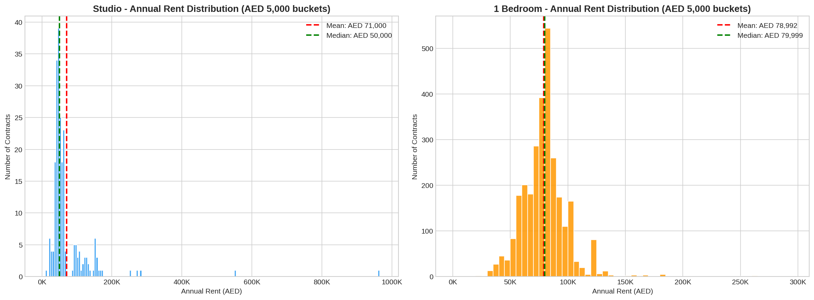
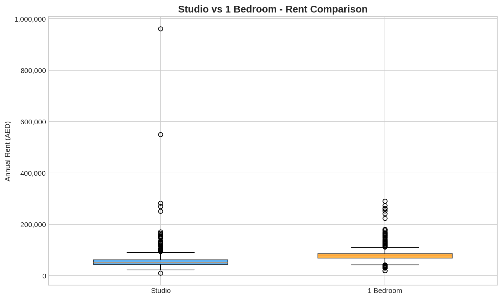
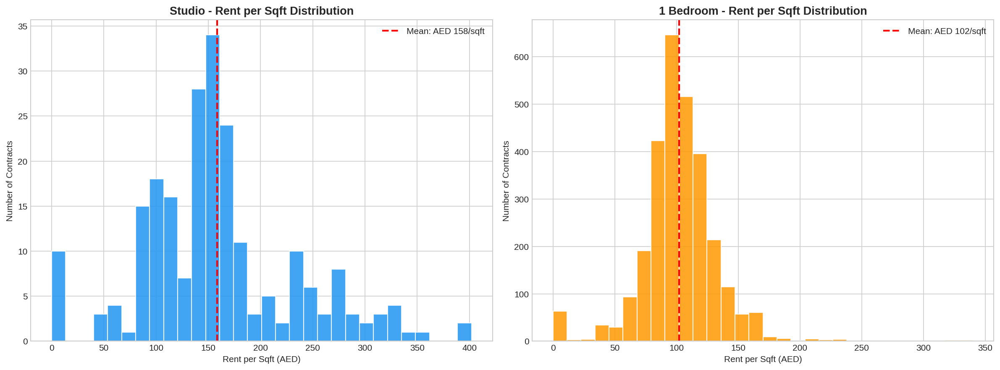
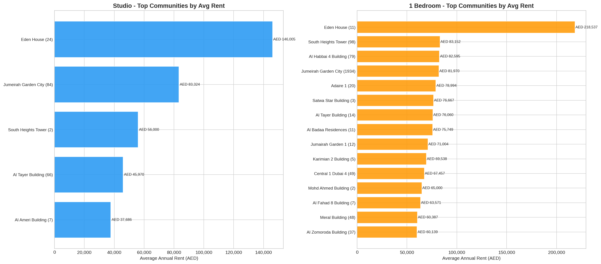
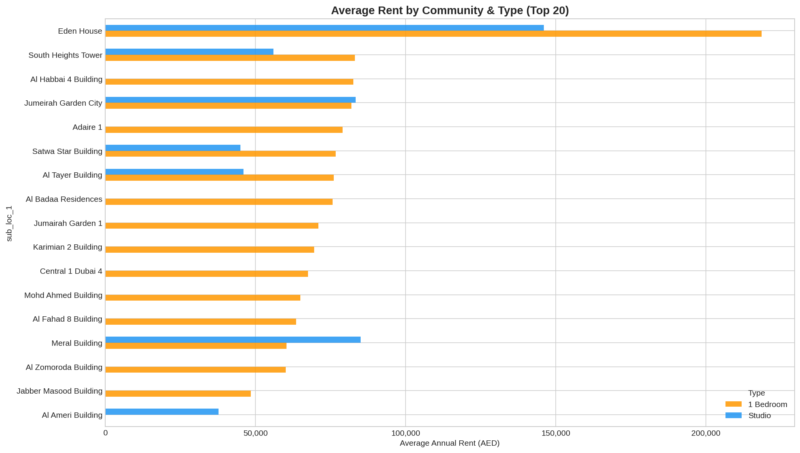
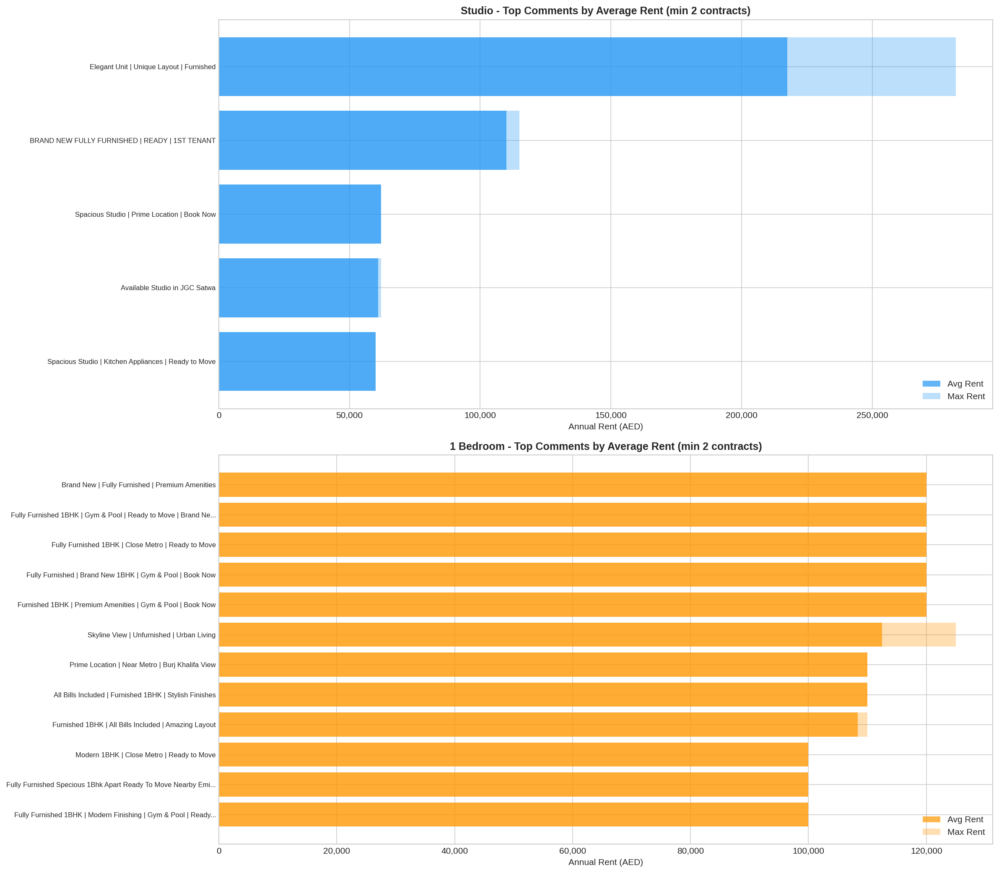
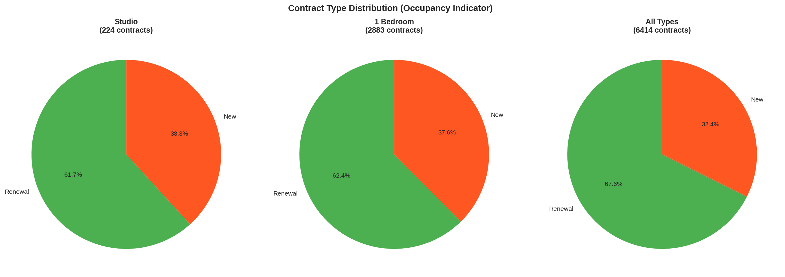
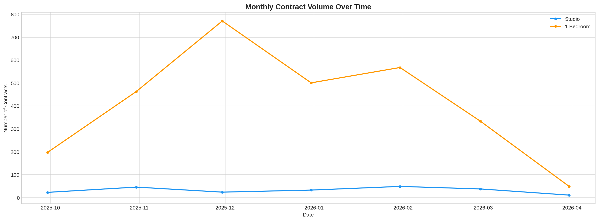
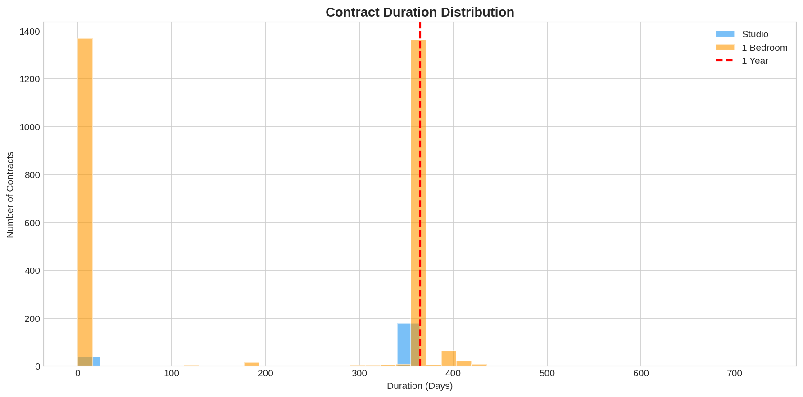
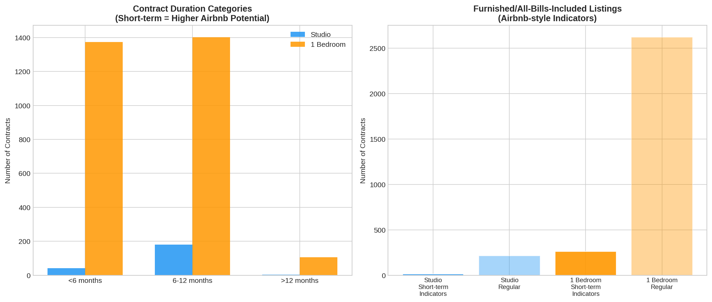

# Al Satwa Rental Market Analysis Report

**Date:** March 11, 2026
**Data Source:** Al Satwa Market Data (6,414 rental contracts)
**Focus:** Studio & 1-Bedroom Apartments (3,107 contracts)

---

## 1. Dataset Overview

| Metric | Value |
|--------|-------|
| Total contracts in dataset | 6,414 |
| Studio contracts | 224 (3.5%) |
| 1-Bedroom contracts | 2,883 (44.9%) |
| Date range | Sep 2025 - Mar 2026 |
| Location | Al Satwa, Dubai |

---

## 2. Price Statistics: Highest, Lowest, Average

### Studio Apartments (224 contracts)

| Metric | Value | Details |
|--------|-------|---------|
| **Highest Rent** | AED 961,000 | Sep 20, 2025 - Jumeirah Garden City / KAY 1 Building |
| **Lowest Rent** | AED 10,928 | Feb 1, 2026 - New contract |
| **Average Rent** | AED 71,000 | |
| **Median Rent** | AED 50,000 | |
| **Std Deviation** | AED 79,186 | High variance indicates wide price range |

### 1-Bedroom Apartments (2,883 contracts)

| Metric | Value | Details |
|--------|-------|---------|
| **Highest Rent** | AED 289,895 | Feb 2, 2026 - Eden House, New contract |
| **Lowest Rent** | AED 20,000 | Jan 1, 2026 - Renewal |
| **Average Rent** | AED 78,992 | |
| **Median Rent** | AED 79,999 | |
| **Std Deviation** | AED 20,262 | More consistent pricing than studios |

### Combined (Studio + 1 Bedroom)

| Metric | Value |
|--------|-------|
| **Highest Rent** | AED 961,000 |
| **Lowest Rent** | AED 10,928 |
| **Average Rent** | AED 78,416 |
| **Median Rent** | AED 78,000 |

---

## 3. Most Common Price Range (AED 5,000 Increments)

### Studio - Most Common: AED 45,000 - 50,000 (39 contracts, 17.4%)

| Price Range (AED) | Contracts | Share |
|-------------------|-----------|-------|
| 45,000 - 50,000 | 39 | 17.4% |
| 40,000 - 45,000 | 34 | 15.2% |
| 50,000 - 55,000 | 25 | 11.2% |
| 60,000 - 65,000 | 23 | 10.3% |
| 35,000 - 40,000 | 18 | 8.0% |
| 55,000 - 60,000 | 18 | 8.0% |

**Key Insight:** Studios concentrate heavily in the AED 35,000-65,000 range (72% of all studio contracts). A secondary cluster exists at AED 90,000-170,000 for premium/furnished studios.

### 1-Bedroom - Most Common: AED 80,000 - 85,000 (544 contracts, 18.9%)

| Price Range (AED) | Contracts | Share |
|-------------------|-----------|-------|
| 80,000 - 85,000 | 544 | 18.9% |
| 75,000 - 80,000 | 392 | 13.6% |
| 70,000 - 75,000 | 286 | 9.9% |
| 85,000 - 90,000 | 260 | 9.0% |
| 60,000 - 65,000 | 201 | 7.0% |
| 65,000 - 70,000 | 181 | 6.3% |

**Key Insight:** 1-bedroom rents are tightly clustered around AED 70,000-90,000, accounting for 51.4% of all contracts. The market has a clear "sweet spot" at AED 80,000-85,000.

---

## 4. Rent per Square Foot Analysis

| Metric | Studio | 1-Bedroom |
|--------|--------|-----------|
| **Average Rent/sqft** | AED 158/sqft | AED 102/sqft |
| **Median Rent/sqft** | AED 150/sqft | AED 100/sqft |
| **Min Rent/sqft** | AED 0/sqft | AED 0/sqft |
| **Max Rent/sqft** | AED 402/sqft | AED 340/sqft |
| **Avg Unit Size** | 428 sqft | 809 sqft |

**Key Insight:** Studios command a 55% premium per square foot (AED 158 vs AED 102) despite being roughly half the size of 1-bedrooms. This makes studios more efficient from a landlord's yield perspective but less value-for-money for tenants.

---

## 5. Top Communities by Rental Amounts

### Studio - Highest Paying Communities

| Community | Avg Rent (AED) | Max Rent (AED) | Contracts | Avg/sqft |
|-----------|---------------|----------------|-----------|----------|
| Eden House | 146,005 | 282,000 | 24 | 265/sqft |
| Jumeirah Garden City | 65,746 | 961,000 | 82 | 162/sqft |
| South Heights Tower | 46,749 | 63,000 | 29 | 120/sqft |
| Dakheel Building | 42,340 | 51,000 | 15 | 107/sqft |
| Al Nabeel Building | 40,000 | 40,000 | 2 | 115/sqft |

### 1-Bedroom - Highest Paying Communities

| Community | Avg Rent (AED) | Max Rent (AED) | Contracts | Avg/sqft |
|-----------|---------------|----------------|-----------|----------|
| Eden House | 130,613 | 289,895 | 279 | 140/sqft |
| Shoba Ivory Building | 104,800 | 105,000 | 5 | 120/sqft |
| Duja Tower | 100,000 | 100,000 | 3 | 97/sqft |
| Jumeirah Garden City | 82,043 | 270,000 | 1097 | 105/sqft |
| South Heights Tower | 68,310 | 93,000 | 378 | 85/sqft |

**Key Insight:** Eden House dominates the premium segment for both studios and 1-bedrooms, with rents ~2x the area average. Jumeirah Garden City is the largest sub-market with 1,097 one-bedroom contracts.

---

## 6. Comments Associated with Highest Rental Amounts

### Studio - Top Comments by Rent

| Rent (AED) | Location | Comment |
|------------|----------|---------|
| 961,000 | Jumeirah Garden City | *(no comment)* |
| 550,000 | Jumeirah Garden City | *(no comment)* |
| 282,000 | Eden House | Luxury Studio / Fully Furnished / Vacant |
| 275,000 | Eden House | Prime Location / Furnished / Brand New |
| 270,000 | Eden House | Brand New / Furnished / Big Layout |
| 252,000 | Eden House | Fully Furnished / City View / Premium |

### 1-Bedroom - Top Comments by Rent

| Rent (AED) | Location | Comment |
|------------|----------|---------|
| 289,895 | Eden House | Luxury 1BHK / Huge Balcony / Ready to Move |
| 270,000 | Jumeirah Garden City | Brand New / Fully Furnished / Premium |
| 263,000 | Eden House | Fully Furnished / Burj Khalifa View |
| 260,000 | Eden House | Brand New / Big Layout / Burj Khalifa view |
| 250,000 | Eden House | Furnished / Premium Location |

### Most Common Comments with Highest Average Rents

**1-Bedroom listings with "Furnished", "Brand New", "Burj Khalifa View"** consistently command premiums of AED 150,000-290,000 -- roughly 2-3x the market average.

---

## 7. Occupancy Rate Analysis

### Contract Type as Occupancy Proxy

The ratio of **Renewal** vs **New** contracts provides insight into occupancy stability:

| Type | Studio | 1-Bedroom | All Types |
|------|--------|-----------|-----------|
| **Renewals** | 113 (50.4%) | 946 (32.8%) | 2,390 (37.3%) |
| **New Contracts** | 70 (31.2%) | 570 (19.8%) | 1,145 (17.9%) |
| **Other/Unspecified** | 41 (18.3%) | 1,367 (47.4%) | 2,879 (44.9%) |
| **Est. Occupancy (Renewal Rate)** | **50.4%** | **32.8%** | **37.3%** |

**Key Insight:** Studios show a notably higher renewal rate (50.4%) compared to 1-bedrooms (32.8%), suggesting studios have stronger tenant retention. This could indicate:
- Studio tenants tend to stay longer once settled
- The studio market is tighter with fewer alternatives
- 1-bedroom tenants have more options and are more mobile

### Monthly Contract Volume Trend

| Month | 1-Bedroom | Studio |
|-------|-----------|--------|
| Sep 2025 | 197 | 23 |
| Oct 2025 | 463 | 46 |
| Nov 2025 | 771 | 24 |
| Dec 2025 | 501 | 33 |
| Jan 2026 | 568 | 49 |
| Feb 2026 | 334 | 38 |
| Mar 2026 (partial) | 49 | 11 |

**Peak activity** occurred in November 2025 for 1-bedrooms (771 contracts) and January 2026 for studios (49 contracts).

---

## 8. Airbnb / Short-Term Rental Occupancy Analysis

### Hotel Apartments (Airbnb Proxy)

| Metric | Value |
|--------|-------|
| Total hotel apartment contracts | 32 |
| Average annual rent | AED 118,579 |
| All are 2-bedroom units | Yes |
| Renewal rate | 0% (all new contracts) |

The **0% renewal rate** for hotel apartments suggests high turnover typical of short-term/Airbnb-style rentals.

### Furnished Units with Airbnb Potential

| Metric | Value |
|--------|-------|
| Total furnished contracts | 517 (of 2,826 where field is populated) |
| Average rent (furnished) | AED 114,476 |
| Furnished premium vs market | ~45% higher |

### Short-Term/Furnished Indicators in Comments

| Type | Short-term Indicators | % of Total | Avg Rent | Market Avg |
|------|----------------------|-----------|----------|------------|
| Studio | 12 | 5.4% | AED 118,375 | AED 71,000 |
| 1-Bedroom | 263 | 9.1% | AED 107,625 | AED 78,992 |

Listings mentioning "furnished", "all bills included", or similar keywords command a **67% premium for studios** and **36% premium for 1-bedrooms**.

### Contract Duration Analysis

| Duration | Count | Share |
|----------|-------|-------|
| Short-term (<6 months) | 1,416 | 45.6% |
| Standard (6-12 months) | 1,583 | 50.9% |
| Long-term (>12 months) | 108 | 3.5% |

- Average duration: 198 days (6.6 months)
- Median duration: 364 days (just under 1 year)

**Key Insight:** Nearly half (45.6%) of contracts are short-term (<6 months), indicating significant Airbnb/short-stay activity in the Al Satwa area. The median of 364 days shows that while many contracts are standard annual leases, the short-term segment is substantial.

---

## 9. Key Takeaways

1. **Studios are underpriced per unit but premium per sqft** - At AED 158/sqft vs AED 102/sqft for 1-beds, studios yield more for landlords per square foot
2. **Sweet spots**: Studios at AED 45,000-50,000; 1-Beds at AED 80,000-85,000
3. **Eden House commands the highest rents** across both categories, ~2x the area average
4. **Furnished/short-term listings carry significant premiums** (36-67% above market)
5. **High short-term contract volume** (45.6%) suggests active Airbnb/short-stay market
6. **Studio occupancy appears stronger** (50.4% renewal) vs 1-beds (32.8%)
7. **Hotel apartments show 0% renewal** - pure transient/Airbnb-style usage
8. **Peak leasing activity**: Nov 2025 for 1-beds, Jan 2026 for studios

---

*Report generated by rental_analysis.py | Data: Al Satwa Market Data as of March 11, 2026*
